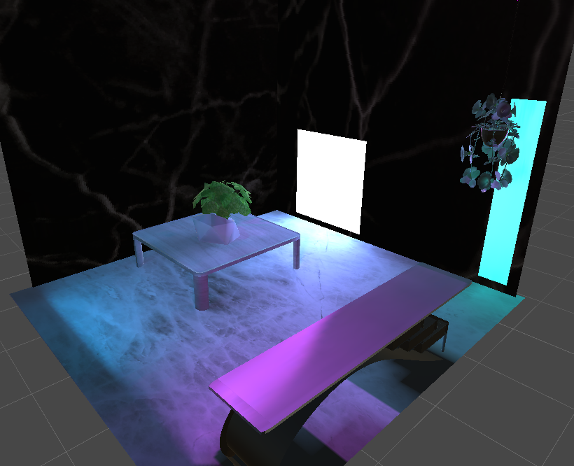
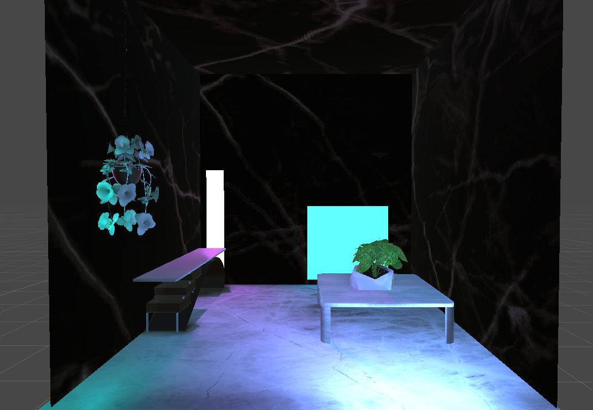

# 'A Plant?, EZ'
Proyecto final de la materia de Gráficas Computacionales

## Propósito del proyecto
Este proyecto tiene como objetivo poner en práctica los conocimientos adquiridos en la clase de Gráficas Computacionales mediante la creación de una aplicación de Unity que permite al usuario regar una planta en 3D y ver cómo ésta crece. El proyecto también busca explorar el tema de las plantas y brindar una experiencia de jardinería virtual.

   

## Características
- Render 3D de una maceta con una planta en una mesa de madera con un fondo estático
- La planta simula el efecto de recibir aire.
- Al inicio se ve una demostracion de cómo ésta crece
- Animaciones de movimiento y del crecimiento de la planta.

## Demostracion
https://skereboi.github.io/a-plant-ez/

## Requisitos 
- Unity versión 2020.3 o superior 
- Navegador web moderno (Google Chrome, Mozilla Firefox, Microsoft Edge, etc.)

